

  <h1>ecommerce_app</h1>

This is a responsive e-commerce app with Supabase authentication, database, and storage for profile picture and products. Includes add to cart, product search, and map-based address selection for delivery. For payment added Razorpay. Tried to keep scalable modular codebase with Provider state management and robust error handling as much as possible

### App Screenshot

[🔗Watch live demo](https://www.youtube.com/shorts/BDC9ujk8LoA)

Login and Register page

  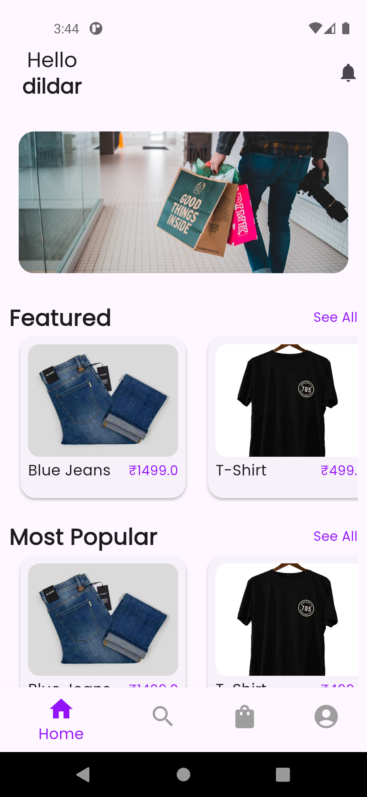
  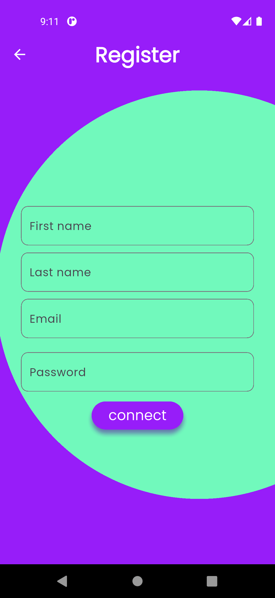

 
Product and Search

  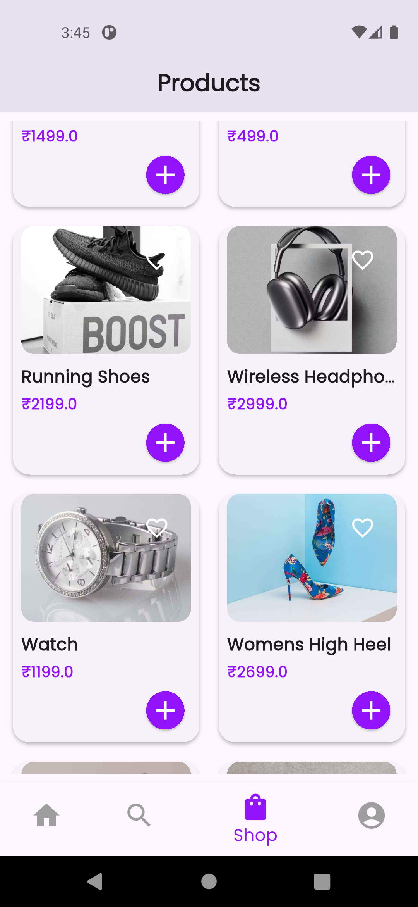
  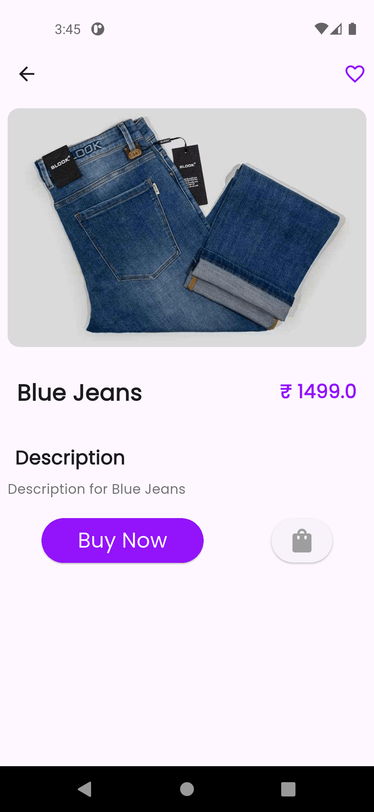
  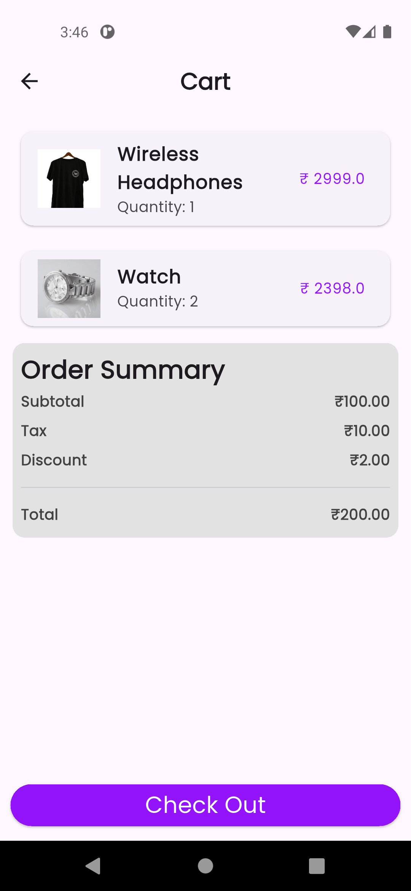

 
Checkout and Location

  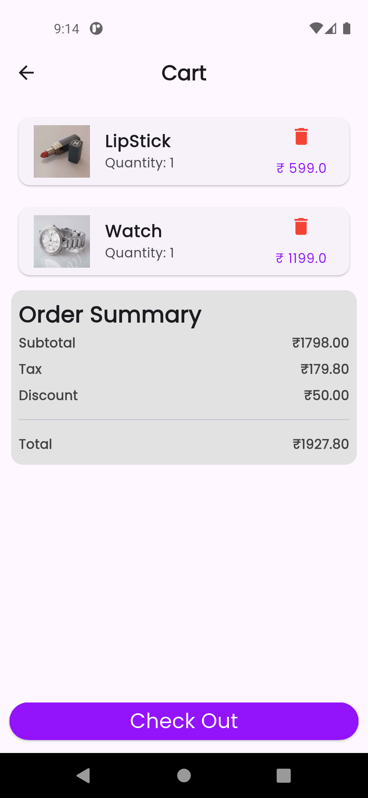
  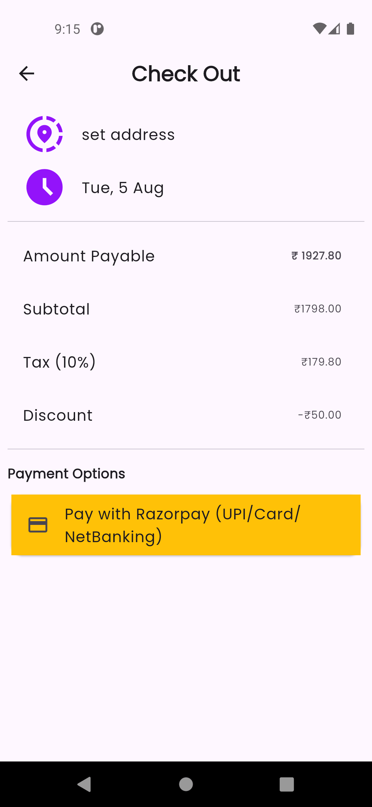
  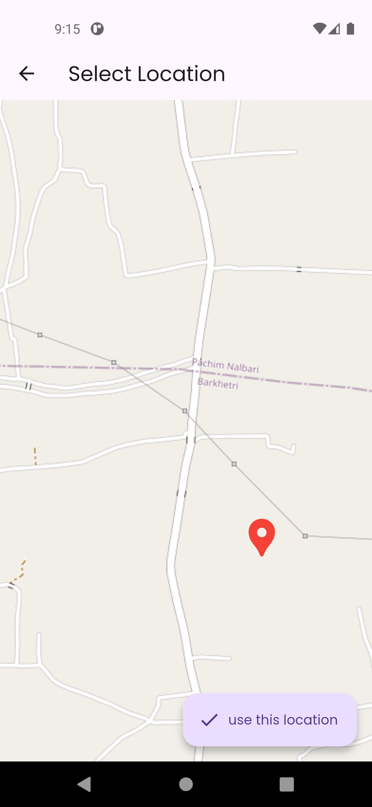

 
Payment

  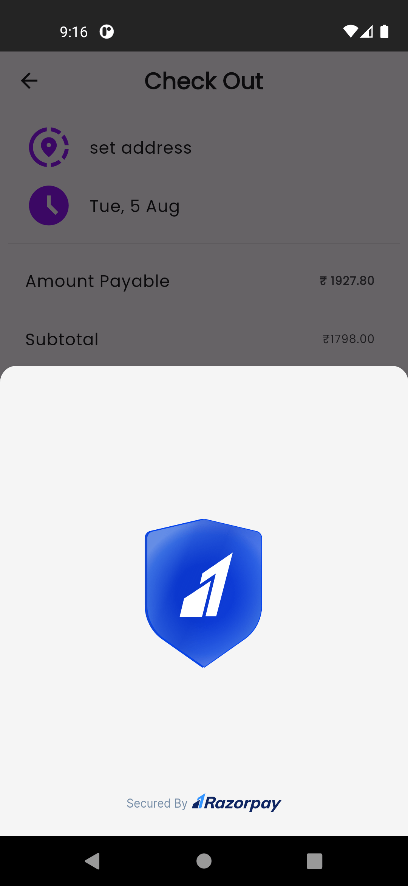
  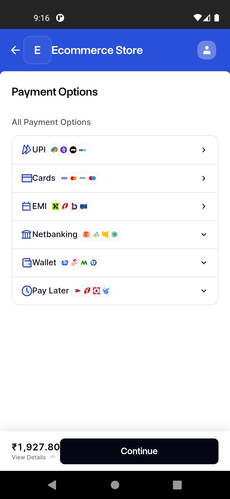

 

### Database Schema (PostgreSQL)

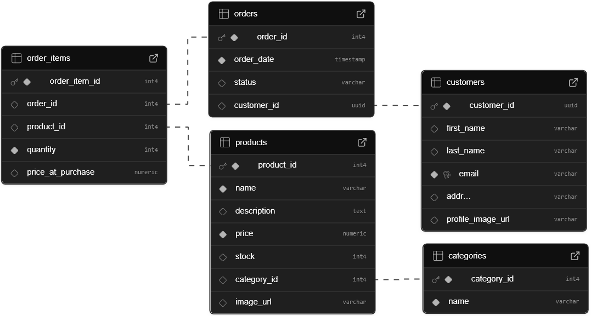

### Problems Faced

- Integrating supabase authentication with provider while maintaining clean code structure. Got confused on setting up the row level security for the database.
- Handling asynchronous image uploads to Supabase Storage and updating state.
- Razorpay integration with flutter.
